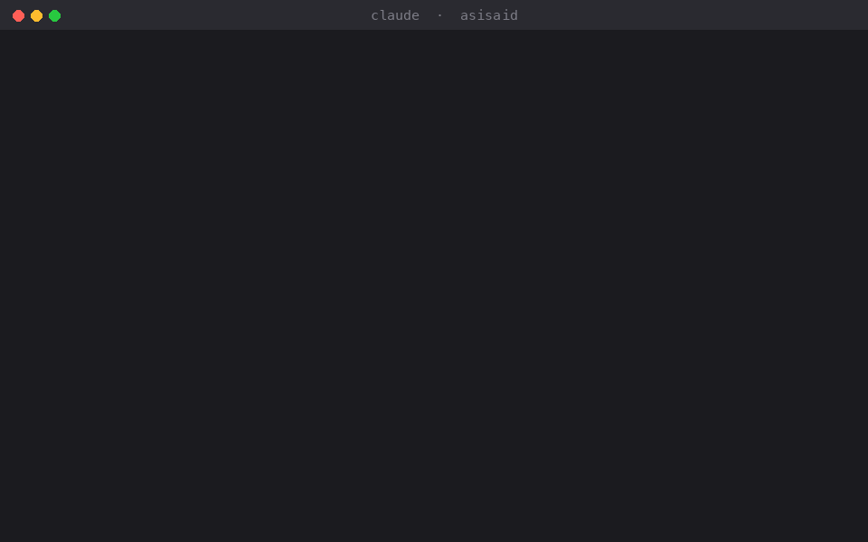

# asisaid

**Stop repeating yourself to your coding agent.**

You say "too long". Two replies later, it's long again. You say "never use axios". After the next compaction, there's axios.

asisaid keeps your feedback in force for the whole session, for Claude Code and Codex.



## What it does

- **Picks up your standing rules.** "Keep it short", "never use emoji", "always run the tests": caught from what you already write. No syntax, no config.
- **Reminds the agent every turn.** One short reminder rides along with each prompt.
- **Sends back replies that break a rule.** Too long after you asked for short, or emoji after you said no emoji: the reply goes back once with a note to fix it.
- **Restores your own words after compaction.** Your rules, your decisions and the last turns, verbatim, right after the summary.

## Short mode

The feedback people repeat most is "too long". Once you ask for brevity in any form ("too long", "in short", "tl;dr", "be concise", "get to the point"...), asisaid switches the session to short mode:

- Every reply comes in your language, with only what matters: the result, what you need to decide or do, and blockers.
- Code, commands, error messages and questions for you are never cut. Code blocks don't count toward the limit.
- Ask for detail in a message ("explain in detail", "walk me through") and that reply can be long.
- Say "you can be more detailed now" and short mode is off.

## Install

**Claude Code**

```
/plugin marketplace add batuhangoktepe/asisaid
/plugin install asisaid@asisaid
```

**Codex**

```
codex plugin marketplace add batuhangoktepe/asisaid
codex plugin add asisaid@asisaid
```

Then approve the hooks once with `/hooks`.

**Any other agent (lite)**

```
npx skills add batuhangoktepe/asisaid
```

An instruction-only skill for Cursor, Gemini CLI, Copilot and other agents that support Agent Skills. It has no hooks, so there are no automatic checks.

## Usage

Nothing to do. Work as usual.

In Claude Code, `/asisaid` shows the rules currently in force and what would come back after a compaction.

## What counts as a rule

| You write | asisaid |
|---|---|
| "Your answers are too long." | Short mode, every reply is checked |
| "In short, what's the fix?" | Short mode, every reply is checked |
| "Never use emoji." | Kept, and every reply is checked |
| "Always run the tests after a change." | Kept and reminded |
| "For now, just say ready." | Ignored, one-off |
| "Why is it still broken?" | Ignored, a question |
| Pasted logs or chats | Ignored, not your words |

Supported languages: English, Turkish.

## How it works

| Hook | asisaid |
|---|---|
| `UserPromptSubmit` | Picks up new rules and adds the reminder |
| `Stop` | Checks the reply against length and emoji rules, sends it back at most once per turn |
| `PreCompact` | Snapshots your words before the summary replaces them |
| `SessionStart` (compact) | Puts them back right after the summary |

No network calls, no extra model calls, no dependencies. Requires Node.js 18+.

## Privacy

Everything stays on your machine, in the plugin's own data directory. Nothing is sent anywhere.

## Configuration

| Variable | Default | |
|---|---|---|
| `ASISAID_BRIEF_WORDS` | `120` | Word limit once you've asked for short replies |
| `ASISAID_MAX_TOKENS` | `2000` | Budget for the note restored after compaction |

## Limitations

- The check runs when the reply is finished, so the long reply is already on screen; the corrected one follows right after.
- Rules are detected with patterns, not a model. Some phrasings will be missed.
- Only length and emoji are checked automatically. Other rules are reminded every turn.

## Development

```
npm test
```

## License

MIT
